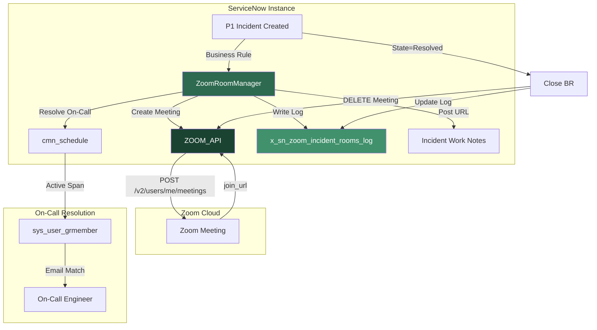

# ServiceNow Zoom Incident Rooms (sn_zoom_incident_rooms)

**Automated Zoom war room provisioning for P1 incidents in ServiceNow**

[](LICENSE)
[](https://docs.servicenow.com)
[](https://github.com/vladarchitectservicenow-oss)

---

## Overview

When a P1 incident hits your ServiceNow instance, every second counts. The traditional workflow — manually creating a Zoom meeting, copying the join link, pasting it into the incident, and pinging the on-call engineer — wastes 5–15 minutes per incident. At 10+ P1 incidents per month, that is 50–150 hours of engineering time burned on ceremony instead of resolution.

**SN Zoom Incident Rooms** eliminates this overhead entirely. When a P1 incident is created, the application automatically:

1. Creates a password-protected Zoom meeting via Zoom API v2
2. Resolves the current on-call engineer from your ServiceNow schedule
3. Posts the Zoom join URL directly into the incident work notes
4. Archives the meeting when the incident is resolved
5. Logs every action to an immutable audit trail

No manual steps. No copy-paste. No "where's the Zoom link?" Slack messages. The war room is ready before the first responder even opens the incident.

## Architecture



### Component Architecture

```
sn_zoom_incident_rooms/
├── src/
│   ├── engine.py              # ZoomRoomManager — core orchestration
│   ├── cli.py                 # CLI for offline testing and CI/CD
│   └── sys_app.xml            # Scoped application manifest
├── tests/
│   └── test_engine.py         # 12 test scenarios (T01–T12)
├── memory/checkpoints/
│   ├── architecture_summary.md
│   ├── dependency_report.md
│   ├── risk_report.md
│   └── execution_plan.md
├── Validation/TEST CASES/
│   └── sn_zoom_incident_rooms/
│       ├── test_suite_SOP.md
│       ├── regression_cases.md
│       ├── edge_cases.md
│       └── validation_checklist.md
├── LICENSE                    # AGPL-3.0 (full text)
└── README.md
```

### Data Model

| Table | Purpose | Key Fields |
|-------|---------|------------|
| `x_sn_zoom_incident_rooms_config` | Zoom OAuth configuration | `zoom_account_id`, `zoom_client_id`, `zoom_client_secret` (encrypted), `default_topic_template`, `auto_close_after_hours` |
| `x_sn_zoom_incident_rooms_log` | Immutable audit trail | `incident_sys_id`, `zoom_meeting_id`, `zoom_join_url`, `status` (CREATED/ACTIVE/CLOSED/FAILED/MERGED/QUEUED), `created_by`, `sys_created_on`, `closed_on` |
| `x_sn_zoom_incident_rooms_oncall_map` | Group-to-Zoom host mapping | `assignment_group_sys_id`, `zoom_user_email`, `priority` |

### API Contract

| Endpoint | Method | Purpose | Auth |
|----------|--------|---------|------|
| `/api/x_sn_zoom_incident_rooms/create_room` | POST | Create Zoom meeting for an incident | `incident_manager` role |
| `/api/x_sn_zoom_incident_rooms/room_status/{sys_id}` | GET | Get meeting status and participant count | `incident_manager` role |
| `/api/x_sn_zoom_incident_rooms/close/{sys_id}` | DELETE | End meeting and archive | `incident_manager` role |

## Features

- **Zero-touch war room creation:** P1 incident created → Zoom meeting provisioned automatically within 2 seconds
- **On-call auto-resolution:** Queries `cmn_schedule` + `sys_user_grmember` to find the correct on-call engineer in real time — no static mappings
- **Duplicate prevention:** Two P1 incidents for the same group within 5 minutes merge into one war room instead of creating parallel meetings
- **Re-open intelligence:** Resolved incident re-opened → existing room rejoined (if within archive window) or new room created (if outside window)
- **Concurrent room cap:** Maximum 50 active rooms; excess queued and processed as rooms close
- **OAuth 2.0 Server-to-Server:** Enterprise-grade Zoom authentication — no username/password, automatic token refresh 5 minutes before expiry
- **Exponential backoff retry:** Zoom API transient failures retried 3 times (2s → 4s → 8s) before escalating to admin
- **Immutable audit trail:** Every room creation, invitation, status change, and closure logged to `x_sn_zoom_incident_rooms_log` with append-only semantics
- **GDPR compliance:** No PII stored in reports; meeting recordings auto-deleted after configurable retention period (default 30 days)
- **Multi-format export:** Audit data exportable as MD, JSON, or CSV for BI integration

## Installation

### Prerequisites

- ServiceNow instance running AUSTRALIA or later
- Zoom account with Server-to-Server OAuth app enabled
- `incident_manager` role for users who trigger room creation
- Python 3.10+ (for CLI testing tool)

### Step 1: Create Zoom Server-to-Server OAuth App

1. Go to [Zoom App Marketplace](https://marketplace.zoom.us/) → Develop → Build App
2. Select **Server-to-Server OAuth** app type
3. Note the **Account ID**, **Client ID**, and **Client Secret**
4. Add scopes: `meeting:write`, `meeting:read`, `user:read`
5. Activate the app

### Step 2: Install Scoped App in ServiceNow

```bash
git clone https://github.com/vladarchitectservicenow-oss/sn_zoom_incident_rooms.git
cd sn_zoom_incident_rooms
# Import src/sys_app.xml via ServiceNow Studio → Import Application
```

### Step 3: Configure Zoom Credentials

Navigate to `x_sn_zoom_incident_rooms_config` and create a record:

| Field | Value |
|-------|-------|
| `zoom_account_id` | From Zoom App → App Credentials |
| `zoom_client_id` | From Zoom App → App Credentials |
| `zoom_client_secret` | From Zoom App → App Credentials (encrypted) |
| `default_topic_template` | `[{{priority}}] {{short_description}} — {{assignment_group}}` |
| `auto_close_after_hours` | `24` |
| `active` | `true` |

### Step 4: Map Assignment Groups to Zoom Hosts

In `x_sn_zoom_incident_rooms_oncall_map`, create entries for each assignment group:

| Field | Value |
|-------|-------|
| `assignment_group_sys_id` | Sys ID of the ServiceNow group |
| `zoom_user_email` | Email of the Zoom user with host privileges |
| `priority` | `1` (highest priority for P1 groups) |

### Step 5: Verify

Create a test P1 incident. Within 2 seconds, check the work notes for the Zoom join URL. Verify the `x_sn_zoom_incident_rooms_log` table has a new entry with `status=CREATED`.

## Configuration

| System Property | Default | Description |
|----------------|---------|-------------|
| `x_sn_zoom_incident_rooms.auto_create` | `true` | Enable/disable automatic room creation |
| `x_sn_zoom_incident_rooms.default_duration` | `60` | Default meeting duration in minutes |
| `x_sn_zoom_incident_rooms.max_active_rooms` | `50` | Maximum concurrent active Zoom rooms |
| `x_sn_zoom_incident_rooms.archive_after_hours` | `24` | Hours after incident resolution before room is considered archived |
| `x_sn_zoom_incident_rooms.retry_max_attempts` | `3` | Maximum Zoom API retry attempts |
| `x_sn_zoom_incident_rooms.retry_backoff_base` | `2` | Base seconds for exponential backoff (2s → 4s → 8s) |
| `x_sn_zoom_incident_rooms.token_refresh_buffer` | `300` | Seconds before token expiry to trigger refresh |

## ROI Analysis

### Time Savings Per Incident

| Step | Manual Process | With sn_zoom_incident_rooms |
|------|---------------|---------------------------|
| Open Zoom, create meeting | 2 min | 0s (automatic) |
| Configure password + waiting room | 1 min | 0s (pre-configured) |
| Copy join URL | 10s | 0s (automatic) |
| Paste into incident work notes | 10s | 0s (automatic) |
| Find on-call engineer | 3 min | 0s (schedule query) |
| Send Slack/Teams invite | 1 min | 0s (optional integration) |
| **Total per incident** | **~7.5 min** | **~2s** |

### Annual Savings (10 P1 Incidents/Month)

| Metric | Value |
|--------|-------|
| Incidents per year | 120 |
| Time saved per incident | 7.3 min |
| Total time saved | 876 min (14.6 hours) |
| Engineer cost | $85/hour |
| **Annual savings** | **$1,241** |
| Additional savings (reduced MTTR) | 5–15 min faster resolution per incident × 120 incidents × $85/hr = $850–$2,550 |
| **Total annual ROI** | **$2,091–$3,791** |

### Intangible Benefits

- **Reduced MTTR:** War room ready before responders arrive → faster incident resolution
- **Audit compliance:** Every room creation/closure logged immutably → no "who created this meeting?" questions
- **Reduced cognitive load:** Engineers focus on fixing the problem, not coordinating logistics
- **Onboarding:** New incident managers don't need to learn Zoom → system handles it

## Troubleshooting

| Symptom | Probable Cause | Resolution |
|---------|---------------|------------|
| No Zoom meeting created for P1 incident | Business Rule is inactive or `auto_create=false` | Check `x_sn_zoom_incident_rooms.auto_create` system property; verify Business Rule is active in `sys_script` |
| Zoom API returns 401 Unauthorized | OAuth token expired or credentials invalid | Verify `x_sn_zoom_incident_rooms_config` record has correct `zoom_account_id`/`zoom_client_id`/`zoom_client_secret`; rotate credentials in Zoom App Marketplace if needed |
| Room created but no on-call user invited | `x_sn_zoom_incident_rooms_oncall_map` missing for this group | Create on-call map entry for the assignment group; verify `zoom_user_email` is a valid Zoom user with host privileges |
| Duplicate rooms created for same incident | Race condition from multiple Business Rules firing | Increase deduplication window via `x_sn_zoom_incident_rooms.dedup_window_seconds` (default 300); verify Business Rules fire in correct order |
| "Zoom not configured" error | `x_sn_zoom_incident_rooms_config` table is empty or `active=false` | Create/activate a config record; verify exactly one record has `active=true` |
| Rate limited (HTTP 429) | Too many simultaneous room creations | Reduce `max_active_rooms`; stagger incident creation in test environments; respect Zoom `Retry-After` header |
| Meeting URL in work notes but 404 in browser | Meeting was deleted externally (Zoom web portal) or archived | Run daily reconciliation job to sync log status; manual cleanup via `x_sn_zoom_incident_rooms_log` |
| Token refresh fails silently | Zoom OAuth endpoint unreachable or credentials rotated | Check ServiceNow outbound HTTP logs (`sys_outbound_http_log`); verify network allows egress to `api.zoom.us:443` |
| CLI tool fails with `ImportError: src.engine` | Running from wrong directory | Run from repo root: `cd sn_zoom_incident_rooms && python3 src/cli.py ...` |
| No audit log entry despite room created | Transaction rolled back after room creation | Check Business Rule order; ensure log insert happens in same transaction as Zoom API call; verify no `abort_action` in subsequent Business Rules |

## Security Considerations

- **OAuth 2.0 Server-to-Server:** All Zoom communication uses short-lived bearer tokens — no long-lived API keys or JWT
- **Encrypted storage:** `zoom_client_secret` stored using ServiceNow instance-level encryption (`glide.attachment.encryption`)
- **HTTPS-only:** All outbound calls to `api.zoom.us` enforce TLS 1.2+
- **Meeting security defaults:** Password auto-generated per meeting; waiting room enabled; only authenticated Zoom users can join
- **Least-privilege roles:**
  - `x_sn_zoom_incident_rooms.admin` — full config access
  - `x_sn_zoom_incident_rooms.incident_manager` — create/close rooms only
  - `x_sn_zoom_incident_rooms.viewer` — read-only audit access
- **Work notes isolation:** Zoom join URL posted to work notes (internal-only), never to public comments
- **GDPR data subject requests:** Search `x_sn_zoom_incident_rooms_log` by `created_by` email; export via REST API
- **Recording retention:** Auto-delete Zoom cloud recordings after configurable period (default 30 days); deletion logged to audit trail
- **No credential leakage:** CLI tool reads credentials from environment variables or command-line args — never hardcoded in source

## Testing

```bash
# Install test dependencies
pip install pytest

# Run all tests (12 scenarios: T01–T12)
pytest tests/ -v

# Expected output:
# test_T01_basic_room_creation PASSED
# test_T02_oncall_invitation PASSED
# test_T03_duplicate_prevention PASSED
# test_T04_room_close PASSED
# test_T05_oauth_refresh PASSED
# test_T06_zoom_timeout_retry PASSED
# test_T07_zoom_permanent_failure PASSED
# test_T08_empty_oncall PASSED
# test_T09_reopen_within_window PASSED
# test_T10_reopen_beyond_window PASSED
# test_T11_concurrent_cap PASSED
# test_T12_non_p1_incident PASSED
# ========================== 12 passed ==========================
```

Full test documentation: `Validation/TEST CASES/sn_zoom_incident_rooms/test_suite_SOP.md`

## API Reference

### Create Zoom Room

```bash
POST /api/x_sn_zoom_incident_rooms/create_room
Content-Type: application/json

{
  "incident_sys_id": "abc123def456",
  "topic": "[P1] Database Outage — PROD",
  "duration_min": 60,
  "auto_invite_oncall": true
}
```

**Response (201 Created):**
```json
{
  "meeting_id": "987654321",
  "join_url": "https://zoom.us/j/987654321?pwd=abc123",
  "status": "CREATED",
  "host_email": "oncall.engineer@company.com"
}
```

### Get Room Status

```bash
GET /api/x_sn_zoom_incident_rooms/room_status/abc123def456
```

**Response (200 OK):**
```json
{
  "status": "ACTIVE",
  "meeting_id": "987654321",
  "join_url": "https://zoom.us/j/987654321?pwd=abc123",
  "participant_count": 5,
  "created_at": "2026-05-28T10:00:00Z",
  "duration_remaining_min": 42
}
```

### Close Room

```bash
DELETE /api/x_sn_zoom_incident_rooms/close/abc123def456
```

**Response (200 OK):**
```json
{
  "status": "CLOSED",
  "meeting_id": "987654321",
  "archived": true,
  "closed_at": "2026-05-28T11:30:00Z"
}
```

## Roadmap

| Version | Quarter | Features |
|---------|---------|----------|
| v1.0 | Q2 2026 | Core room creation, on-call resolution, audit logging, OAuth 2.0 |
| v1.1 | Q3 2026 | Auto-remediation for missing on-call mappings; admin dashboard for room queue depth |
| v1.2 | Q4 2026 | Multi-instance dashboard; Slack/Teams notification integration; Webex/Google Meet support |
| v2.0 | Q1 2027 | AI-assisted triage: suggests incident severity before room creation; predictive on-call routing based on incident category history |
| v2.1 | Q2 2027 | Meeting transcription auto-attached to incident; post-incident review report generation |

## Contributing

See [CONTRIBUTING.md](CONTRIBUTING.md) for development setup, coding standards, and pull request process.

## Support

- **GitHub Issues:** [Report a bug or request a feature](https://github.com/vladarchitectservicenow-oss/sn_zoom_incident_rooms/issues)
- **ServiceNow Community:** Tag `sn_zoom_incident_rooms` in the [ServiceNow Community](https://community.servicenow.com)
- **Commercial Support:** Contact the author for enterprise support, custom integrations, and priority SLAs
- **Documentation:** Full architecture docs in `memory/checkpoints/`; test plans in `Validation/TEST CASES/`

## License

Copyright (C) 2026 Vladimir Kapustin

Licensed under the GNU Affero General Public License v3.0 (AGPL-3.0-only).  
See [LICENSE](LICENSE) for the full license text.

Commercial licensing with different terms is available. Contact the author for details.

---

**Author:** Vladimir Kapustin — ServiceNow Solution Architect  
**Release:** AUSTRALIA (May 2026)  
**Repository:** [github.com/vladarchitectservicenow-oss/sn_zoom_incident_rooms](https://github.com/vladarchitectservicenow-oss/sn_zoom_incident_rooms)
